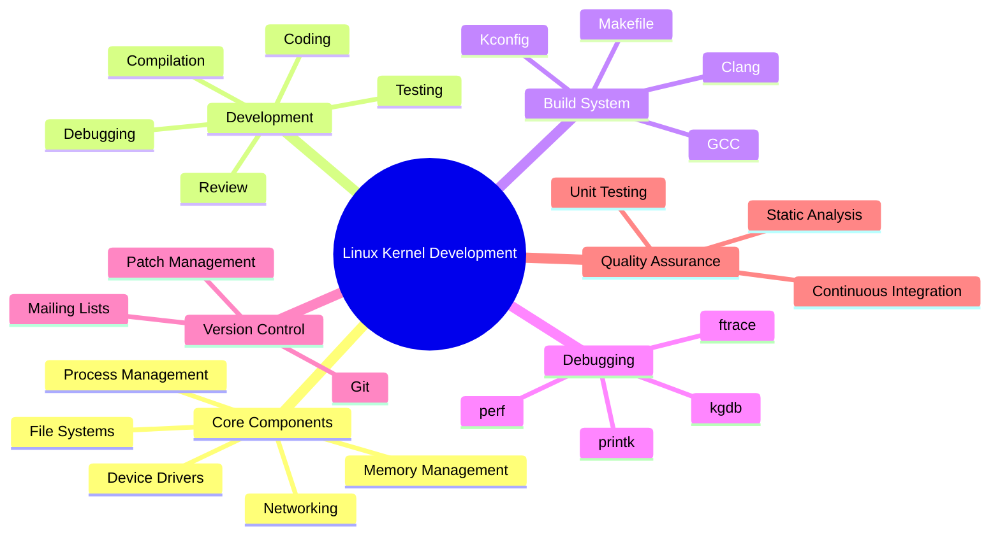

    

        
    

# **`Awesome`** [Linux](https://github.com/cybersecurity-dev/awesome-linux-kernel-development) Kernel [Development](https://github.com/cybersecurity-dev/linux-kernel-development-toolkit) Resources 

 

    
    &nbsp;
    
    &nbsp;
    
    

## 📖 Contents
- [Books](#books)
- [Videos](#videos)
- [My Other Awesome Lists](#my-other-awesome-lists)
- [Contributing](#contributing)
- [Contributors](#contributors)

### Books
* [Linux Kernel Programming: A comprehensive and practical guide to kernel internals, writing modules, and kernel synchronization](https://www.amazon.com/Linux-Kernel-Programming-practical-synchronization/dp/1803232226)
* [Linux Kernel Programming Part 2 - Char Device Drivers and Kernel Synchronization: Create user-kernel interfaces, work with peripheral I/O, and handle hardware interrupts](https://www.amazon.com/Linux-Kernel-Programming-Part-Synchronization-ebook/dp/B08ZSV58G8)
* [Understanding the Linux Kernel: From I/O Ports to Process Management](https://www.amazon.com/Understanding-Linux-Kernel-Process-Management-ebook/dp/B0043D2E54)

### Videos
* 
##

### My Other Awesome Lists
You can access the my other awesome lists [here](https://cyberthreatdefence.com/my_awesome_lists)

### Contributing
[Contributions of any kind welcome, just follow the guidelines](contributing.md)!

### Contributors
[Thanks goes to these contributors](https://github.com/cybersecurity-dev/awesome-linux-kernel-development-resources/graphs/contributors)!

### License

[🔼 Back to top](#awesome-linux-kernel-development-resources-)
